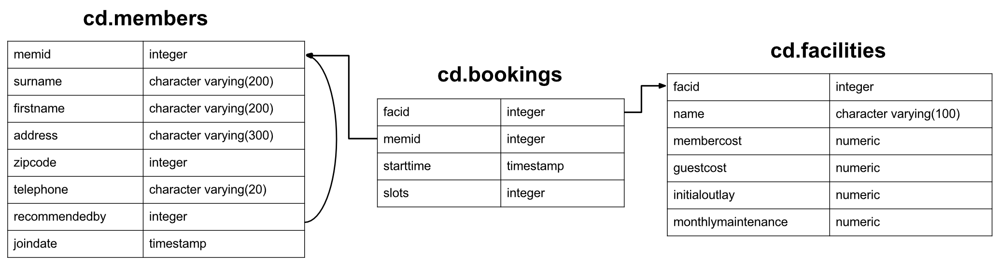

# Overview

I am going to give you a few tasks for you to prepare for technologies we will use along the project.

The first task is based on SQL and databases. I recommend that you take your time and do your research as you progress in the task list. I am assuming some of these tasks are basic to you but I expect that with some, you are going to learn new stuff.

Reach out to me if you have any questions and comments.


## 1- Download latest stable version of PostgresSQL database on your computer.

Postgres 16 was downloaded which came with pg Admin 4 for a gui interface, stackblitz for managing dependancies and psql for command line

## conect to docker

```bash
sudo docker run --name greenhub_trx -e POSTGRES_PASSWORD=mysecretpassword -v postgres:/var/lib/postgresql/data -p 5432:5432 -d postgres
```

## 2- Download PgAdmin - a tool where you can manage PostgresSQL database and run PSQL queries. Research what PSQL is.

Pg Admin 4 was installed in the windows postgres 16 bundle.

we can use psql to log into a database using the command

```bash
psql -U postgres -h localhost -p 5432 postgres
```

then we input the setup password we used to create the postgresql server
This returns a postgresql shell where we can run sql commands to query or add users to a database


## 3- In PostgresSQL, create a schema with name "cd" and database call "exercises". You can use it via PGadmin user interface or with PSQL query.

Within the postgresql shell, we create the exercises database by
```sql
CREATE DATABASE exercises;
```
We must recall to end sql with ;
We can confirm formation of our database by using 
```sql 
\l
```
Now we create a schema
```sql
CREATE SCHEMA cd;
```
we can list all schemas using the command
```sql
\dn+
```


## 4- In this schema, create the following database model and data using the attached script.



### This is called an entity relationship (ER) diagram. Research how it is used.

An Entity-Relationship (ER) diagram is a visual representation of the data model that represents the structure of a database. It is commonly used in database design to illustrate the relationships between entities, which are the major entities within a system that have attributes or properties. ER diagrams help in understanding the data requirements and the organization of data within a system.


First of all we created the prevoius schema in the postgres database thus we shift to the exercises database with the command
```sql
\c exercises postgres
```
We create a schema cd in the correct database

Now we can create the tables
```sql
CREATE TABLE cd.members (
    memid integer PRIMARY KEY,
    surname character varying(200),
    firstname character varying(200),
    address character varying(300),
    zipcode integer,
    telephone character varying(20),
    recommendedby integer REFERENCES cd.members(memid),
    joindate date
);
```
```sql
CREATE TABLE cd.facilities (
    facid integer PRIMARY KEY,
    name character varying(200),
    membercost numeric,
    guestcost numeric,
    initialoutlay numeric,
    monthlymaintenance numeric
);
```
```sql
CREATE TABLE cd.bookings (
    facid integer PRIMARY KEY REFERENCES cd.facilities(facid),
    memid integer REFERENCES cd.members(memid),
    starttime timestamp without time zone,
    slots integer
);
```
We can confirm the creation of the tables by using the command
```sql
\dt+ cd.*
```
### When creating the model. create an additional table called cd.bookings2. But this time, create it so that data is partitioned by memid column. Research what partitions' purpose are, what type partitions there are and which partition type would be best fit for memid column.

```sql
CREATE TABLE cd.bookings2 (
    facid integer REFERENCES cd.facilities(facid),
    memid integer PRIMARY KEY REFERENCES cd.members(memid),
    starttime timestamp without time zone,
    slots integer
) PARTITION BY RANGE (memid);
```

The primary purposes of table partitions include:

- Partitioning can improve query performance by reducing the amount of data that needs to be scanned. Queries that involve filtering based on the partition key can skip unnecessary partitions.

- Partitions can make it easier to manage large tables. For example, you can perform maintenance tasks on individual partitions rather than the entire table.

- Partitions allow you to organize your data based on specific criteria, which can align with how the data is accessed or queried.

There are several types of partitioning in PostgreSQL:
Range Partitioning: Partitions are defined by a range of values for the partition key.
List Partitioning: Partitions are defined by specific values for the partition key.
Hash Partitioning: Partitions are assigned based on a hash function applied to the partition key.

Best Fit for memid Column:
RANGE partitioning is a suitable choice. It allows you to define ranges of memid values for each partition. Hash partitioning isn't suitable as memid is likely not hash generated and list partitioning is not suitable as it requires you to define specific values for each partition.

## 5- Research the relationships between the tables you see in the model. Specifically explain to me what kind of constraints are being used in the model and what these constraints are created for.

The relationships between the tables in the model include:

- Many to One Relationship: The recommendedby column in the members table is a foreign key that references the memid column in the same table. This represents a many-to-one relationship, where multiple members can be recommended by the same member.

- One to Many Relationship: The facid column in the bookings table is a foreign key that references the facid column in the facilities table. This represents a one-to-many relationship, where a facility can have multiple bookings.

The constraints used in the model include:

- Primary Key Constraint: The memid column in the members table is defined as the primary key, ensuring that each member has a unique identifier.

- Foreign Key Constraint: The recommendedby column in the members table is a foreign key that references the memid column in the same table. This ensures that the recommendedby column contains valid references to existing members.


These constraints are created to enforce data integrity and ensure that the data in the tables follows specific rules. For example, the primary key constraint ensures that each member has a unique identifier, while the foreign key constraint ensures that the recommendedby column contains valid references to existing members.

## 6- Research why the constraints are created at the end of the script and not at the beginning.

Constraints are created at the end of the script to ensure that all the tables and columns referenced by the constraints have been created before the constraints are applied. If constraints were created at the beginning of the script, there would be a risk of referencing tables or columns that do not yet exist, leading to errors or failed constraint creation.

We can add constraints for example
```sql
ALTER TABLE cd.members
ADD CONSTRAINT unique_memid 
UNIQUE (memid);
```
```sql
ALTER TABLE cd.members
ADD CONSTRAINT non_negative_zipcode
CHECK (zipcode >= 0);
```


## 7-Research the type of index it is used in the data model. What is this type of index good for? Research other types of index that can be used.

Index in the Data Model:
In the provided data model, no specific index creation statements were included. Also checking pgAdmin4, no indexes were created. However, we can create indexes to improve query performance for specific columns. For example, we can create an index on the memid column in the members table to speed up queries that filter or join based on the memid column.

```sql
CREATE INDEX idx_memid ON cd.members(memid);
```

Types of Indexes:
1. B-Tree Index:
Use Case: B-Tree indexes are the default index type in PostgreSQL and are suitable for a wide range of scenarios. They work well for equality and range queries.
Example: Creating a B-Tree index on a column.
```sql
CREATE INDEX idx_column_name ON table_name(column_name);
```

2. Hash Index:
Use Case: Hash indexes are efficient for equality queries but less suitable for range queries. They are suitable for scenarios where exact matches are common.
Example: Creating a Hash index.
```sql
CREATE INDEX idx_column_name ON table_name USING hash (column_name);
```

3. GIN (Generalized Inverted Index) Index:
Use Case: GIN indexes are used for complex data types like arrays and are beneficial for searching and indexing array elements.
Example: Creating a GIN index on an array column.
```sql
CREATE INDEX idx_array_column ON table_name USING gin (array_column);
```

4. GiST (Generalized Search Tree) Index:
Use Case: GiST indexes are suitable for complex data types and are used in scenarios like full-text search or geometric data types.
Example: Creating a GiST index on a geometric column.
```sql
CREATE INDEX idx_geom_column ON table_name USING gist (geom_column);
```

5. SP-GiST (Space-Partitioned Generalized Search Tree) Index:
Use Case: SP-GiST indexes are designed for special data types with a space-partitioned structure, like network addresses or IP ranges.
Example: Creating an SP-GiST index.
```sql
CREATE INDEX idx_network_column ON table_name USING spgist (network_column);
```

6. BRIN (Block Range INdex) Index:
Use Case: BRIN indexes are useful for very large tables where the data is naturally sorted or clustered. They are beneficial for range queries.
Example: Creating a BRIN index on a column.
```sql
CREATE INDEX idx_range_column ON table_name USING brin (range_column);
```


## 8- Once done, start doing these SQL exercises. https://pgexercises.com/questions/basic/


## Let me know when done. Next step, we will look into stored procedures., performance tuning and monitoring for databases.
